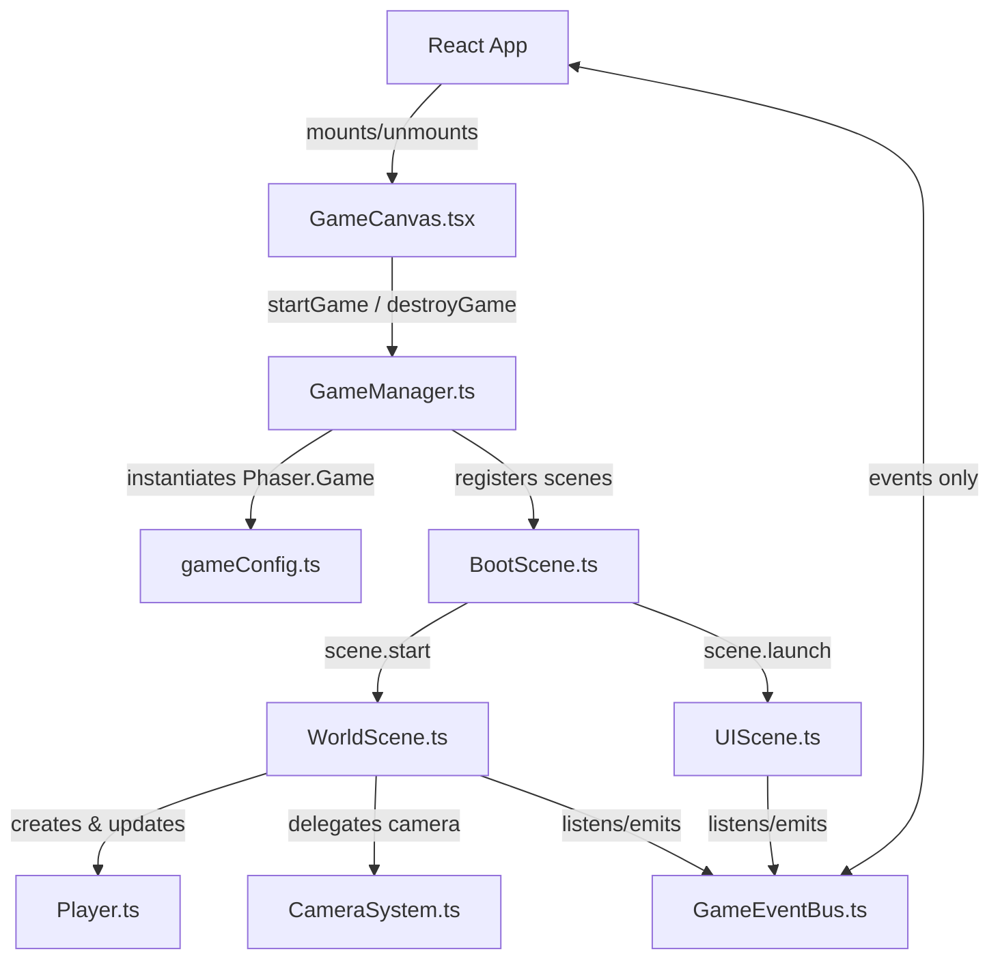
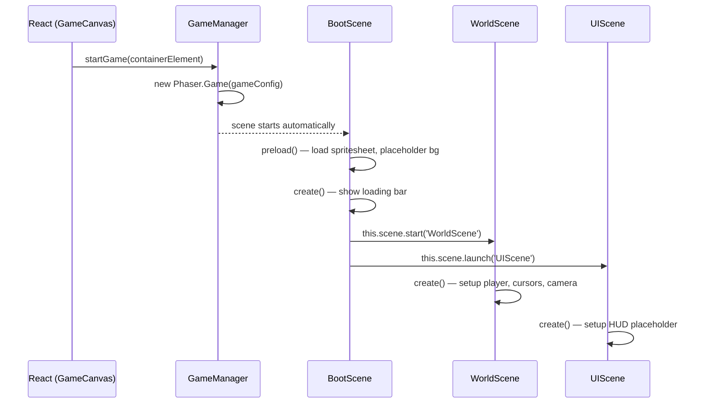
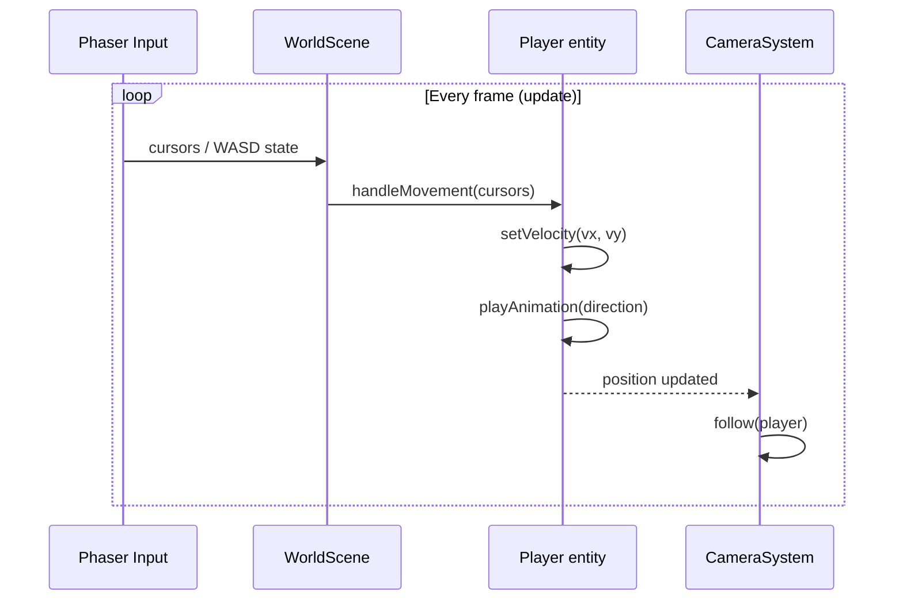
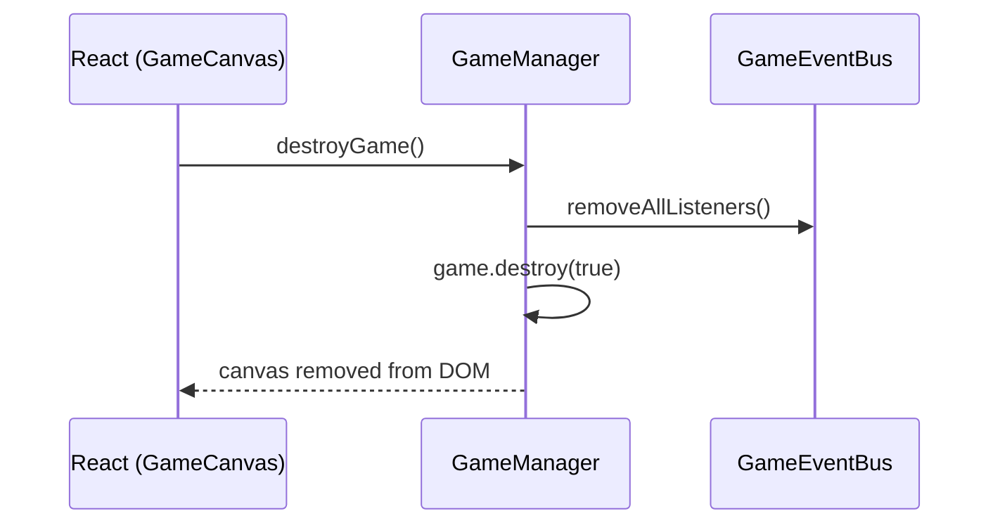

# Design Document: Player Movement

## Overview

This feature introduces the first interactive game screen for QuestBoard: a Phaser 3 canvas mounted inside a React component where a player character can move freely using W-A-S-D keys. It establishes the foundational game layer architecture — `GameCanvas`, `GameManager`, `BootScene`, `WorldScene`, `UIScene`, `Player` entity, `CameraSystem` — that all future game features will build upon.

The scope is intentionally narrow: no backend integration, no XP/level events, no tilemap. The goal is a working, well-structured game loop with smooth player movement and animations running inside the QuestBoard React app.

## Architecture



## Sequence Diagrams

### Game Initialization Flow



### Player Movement Loop



### React Unmount / Cleanup Flow



## Components and Interfaces

### Component: GameCanvas.tsx

**Purpose**: Single React component that owns the Phaser game lifecycle. Mounts the canvas on mount, destroys it on unmount.

**Interface**:
```typescript
// src/features/game/components/GameCanvas.tsx
export function GameCanvas(): JSX.Element
// No props — game state is managed entirely inside Phaser
```

**Responsibilities**:
- Create a `<div id="game-container">` ref and pass it to `GameManager.startGame()`
- Call `GameManager.destroyGame()` on React unmount
- Apply CSS to make the container fill its parent (full-screen or fixed size)

---

### Component: GameManager.ts

**Purpose**: Single entry point for the Phaser game instance. Prevents duplicate instances.

**Interface**:
```typescript
// src/game/GameManager.ts
export function startGame(parent: HTMLElement): Phaser.Game
export function destroyGame(): void
export function getGame(): Phaser.Game | null
```

**Responsibilities**:
- Instantiate `Phaser.Game` with `gameConfig` and the provided parent element
- Guard against creating a second instance if one already exists
- Expose `destroyGame()` for clean teardown (removes canvas, stops all scenes)
- Hold a module-level reference to the active game instance

---

### Component: GameEventBus.ts

**Purpose**: Singleton `Phaser.Events.EventEmitter` that bridges React and Phaser without coupling them.

**Interface**:
```typescript
// src/game/GameEventBus.ts
export const GameEventBus: Phaser.Events.EventEmitter

export const GAME_EVENTS: {
  TASK_COMPLETED: 'task:completed'
  LEVEL_UP: 'level:up'
  ACHIEVEMENT_UNLOCKED: 'achievement:unlocked'
  PLAYER_DATA_LOADED: 'player:data_loaded'
  LEADERBOARD_UPDATED: 'leaderboard:updated'
}
```

**Responsibilities**:
- Provide a stable event channel between React services and Phaser scenes
- Never hold references to React components or Phaser scenes directly

---

### Component: gameConfig.ts

**Purpose**: Centralized Phaser configuration object.

**Interface**:
```typescript
// src/game/config/gameConfig.ts
export const gameConfig: Phaser.Types.Core.GameConfig
```

**Key settings**:
- `type: Phaser.AUTO` — WebGL with Canvas fallback
- `pixelArt: true` — disables antialiasing
- `physics.arcade` with `gravity: { x: 0, y: 0 }`
- `scale.mode: Phaser.Scale.FIT` with `autoCenter: CENTER_BOTH`
- `scene: [BootScene, WorldScene, UIScene]`

---

### Component: BootScene.ts

**Purpose**: Preloads all global assets and transitions to the main game scenes.

**Interface**:
```typescript
// src/game/scenes/BootScene.ts
export class BootScene extends Phaser.Scene {
  preload(): void   // load spritesheet, placeholder background
  create(): void    // start WorldScene, launch UIScene
}
```

**Responsibilities**:
- Load `player-default.png` spritesheet (32×32 frames)
- Load a placeholder background image or color rectangle
- Display a simple loading progress bar
- On complete: `this.scene.start('WorldScene')` and `this.scene.launch('UIScene')`

---

### Component: WorldScene.ts

**Purpose**: Main game scene — renders the world, manages the Player entity, handles input, delegates camera.

**Interface**:
```typescript
// src/game/scenes/WorldScene.ts
export class WorldScene extends Phaser.Scene {
  private player: Player
  private cameraSystem: CameraSystem
  private cursors: Phaser.Types.Input.Keyboard.CursorKeys
  private wasd: WASDKeys

  create(): void
  update(): void
}

type WASDKeys = {
  up: Phaser.Input.Keyboard.Key
  down: Phaser.Input.Keyboard.Key
  left: Phaser.Input.Keyboard.Key
  right: Phaser.Input.Keyboard.Key
}
```

**Responsibilities**:
- Instantiate `Player` at the world center (or spawn point)
- Set up both arrow key cursors and W-A-S-D key bindings
- Call `player.handleMovement(cursors, wasd)` every frame in `update()`
- Instantiate `CameraSystem` and configure it to follow the player
- Set world bounds for the camera
- Listen to `GameEventBus` for future game events (stubbed for now)

---

### Component: UIScene.ts

**Purpose**: Parallel HUD scene — renders overlay UI elements on top of WorldScene.

**Interface**:
```typescript
// src/game/scenes/UIScene.ts
export class UIScene extends Phaser.Scene {
  create(): void
  update(): void
}
```

**Responsibilities**:
- Run in parallel with `WorldScene` (launched via `scene.launch`)
- Display a minimal HUD placeholder (e.g., "QuestBoard" text, connection status)
- Listen to `GameEventBus` for future HUD events (XP bar, level display)
- Never access `WorldScene` objects directly

---

### Component: Player.ts

**Purpose**: Phaser `Physics.Arcade.Sprite` subclass representing the player character.

**Interface**:
```typescript
// src/game/entities/Player.ts
export class Player extends Phaser.Physics.Arcade.Sprite {
  constructor(scene: Phaser.Scene, x: number, y: number)

  handleMovement(
    cursors: Phaser.Types.Input.Keyboard.CursorKeys,
    wasd: WASDKeys
  ): void

  private playMovementAnimation(vx: number, vy: number): void
  private stopMovement(): void
}
```

**Responsibilities**:
- Register all five animations (`idle`, `walk-down`, `walk-up`, `walk-left`, `walk-right`) in the constructor
- In `handleMovement`: read input, compute velocity vector, call `setVelocity`, call `playMovementAnimation`
- Diagonal movement: both axes active simultaneously, velocity normalized to `SPEED / √2` to prevent faster diagonal movement
- When no input: `setVelocity(0, 0)` and play `idle`
- Animation priority: vertical movement takes precedence over horizontal when both axes are pressed (configurable)

---

### Component: CameraSystem.ts

**Purpose**: Encapsulates all camera configuration and follow behavior.

**Interface**:
```typescript
// src/game/systems/CameraSystem.ts
export class CameraSystem {
  constructor(scene: Phaser.Scene, worldWidth: number, worldHeight: number)
  follow(target: Phaser.GameObjects.GameObject): void
  setBounds(x: number, y: number, width: number, height: number): void
}
```

**Responsibilities**:
- Configure `cameras.main` with world bounds
- Apply smooth follow with lerp (`0.1, 0.1`)
- Expose `follow()` so `WorldScene` can pass the player after creation

## Data Models

### PlayerConfig

```typescript
interface PlayerConfig {
  x: number           // initial spawn X in world pixels
  y: number           // initial spawn Y in world pixels
  speed: number       // movement speed in pixels/second (default: 160)
  texture: string     // spritesheet key (default: 'player-default')
}
```

### AnimationConfig

```typescript
interface AnimationConfig {
  key: string         // animation key (e.g., 'walk-down')
  frameStart: number  // first frame index in spritesheet
  frameEnd: number    // last frame index in spritesheet
  frameRate: number   // frames per second
  repeat: number      // -1 for loop, 0 for one-shot
}

// Defined animations for player-default.png (32x32 frames):
const PLAYER_ANIMATIONS: AnimationConfig[] = [
  { key: 'idle',       frameStart: 0,  frameEnd: 3,  frameRate: 6,  repeat: -1 },
  { key: 'walk-down',  frameStart: 4,  frameEnd: 7,  frameRate: 10, repeat: -1 },
  { key: 'walk-up',    frameStart: 8,  frameEnd: 11, frameRate: 10, repeat: -1 },
  { key: 'walk-left',  frameStart: 12, frameEnd: 15, frameRate: 10, repeat: -1 },
  { key: 'walk-right', frameStart: 16, frameEnd: 19, frameRate: 10, repeat: -1 },
]
```

**Validation Rules**:
- `speed` must be a positive number
- `frameStart` must be ≤ `frameEnd`
- `frameRate` must be > 0
- `texture` key must be loaded in Phaser's texture cache before use

### WASDKeys

```typescript
type WASDKeys = {
  up: Phaser.Input.Keyboard.Key    // W
  down: Phaser.Input.Keyboard.Key  // S
  left: Phaser.Input.Keyboard.Key  // A
  right: Phaser.Input.Keyboard.Key // D
}
```

## Algorithmic Pseudocode

### Player Movement Algorithm

```typescript
// Player.handleMovement — called every frame from WorldScene.update()
function handleMovement(
  cursors: CursorKeys,
  wasd: WASDKeys
): void {
  // PRECONDITION: cursors and wasd are valid, non-null key objects
  // PRECONDITION: this.body is an ArcadePhysicsBody (gravity = 0)

  const up    = cursors.up.isDown    || wasd.up.isDown
  const down  = cursors.down.isDown  || wasd.down.isDown
  const left  = cursors.left.isDown  || wasd.left.isDown
  const right = cursors.right.isDown || wasd.right.isDown

  let vx = 0
  let vy = 0

  if (left)  vx -= SPEED
  if (right) vx += SPEED
  if (up)    vy -= SPEED
  if (down)  vy += SPEED

  // Normalize diagonal velocity to prevent faster diagonal movement
  // INVARIANT: |velocity| <= SPEED at all times
  if (vx !== 0 && vy !== 0) {
    const factor = SPEED / Math.sqrt(SPEED * SPEED + SPEED * SPEED)
    vx *= factor
    vy *= factor
  }

  this.setVelocity(vx, vy)
  this.playMovementAnimation(vx, vy)

  // POSTCONDITION: velocity magnitude <= SPEED
  // POSTCONDITION: animation matches movement direction
}
```

**Preconditions:**
- `cursors` and `wasd` are initialized Phaser key objects
- `this.body` is an `Arcade.Body` with gravity disabled
- `SPEED` is a positive constant

**Postconditions:**
- `Math.sqrt(vx² + vy²) <= SPEED` — velocity magnitude never exceeds `SPEED`
- The playing animation matches the dominant movement direction
- When no keys are pressed, velocity is `(0, 0)` and `idle` animation plays

**Loop Invariants (called every frame):**
- Player position is always within world bounds (enforced by Arcade physics world bounds)
- Animation state is always one of the five defined animation keys

### Animation Selection Algorithm

```typescript
function playMovementAnimation(vx: number, vy: number): void {
  // PRECONDITION: vx and vy are the current velocity components

  if (vx === 0 && vy === 0) {
    if (this.anims.currentAnim?.key !== 'idle') {
      this.play('idle')
    }
    return
  }

  // Vertical takes priority over horizontal
  if (vy < 0) {
    this.play('walk-up', true)    // true = ignore if already playing
  } else if (vy > 0) {
    this.play('walk-down', true)
  } else if (vx < 0) {
    this.play('walk-left', true)
  } else {
    this.play('walk-right', true)
  }

  // POSTCONDITION: currentAnim.key ∈ { 'idle', 'walk-up', 'walk-down', 'walk-left', 'walk-right' }
}
```

### GameManager Singleton Guard

```typescript
let gameInstance: Phaser.Game | null = null

function startGame(parent: HTMLElement): Phaser.Game {
  // PRECONDITION: parent is a mounted DOM element
  if (gameInstance !== null) {
    console.warn('GameManager: game already running, returning existing instance')
    return gameInstance
  }

  const config = { ...gameConfig, parent }
  gameInstance = new Phaser.Game(config)
  return gameInstance

  // POSTCONDITION: gameInstance is non-null
  // POSTCONDITION: exactly one Phaser.Game exists in the DOM
}

function destroyGame(): void {
  if (gameInstance === null) return
  GameEventBus.removeAllListeners()
  gameInstance.destroy(true)
  gameInstance = null

  // POSTCONDITION: gameInstance is null
  // POSTCONDITION: no Phaser canvas remains in the DOM
}
```

## Key Functions with Formal Specifications

### WorldScene.create()

```typescript
create(): void
```

**Preconditions:**
- `BootScene` has completed preloading all assets
- Spritesheet `'player-default'` is in Phaser's texture cache

**Postconditions:**
- `this.player` is a valid `Player` instance added to the scene
- `this.cursors` and `this.wasd` are initialized key bindings
- `this.cameraSystem` is configured and following the player
- `GameEventBus` listeners for this scene are registered

### WorldScene.update()

```typescript
update(): void
```

**Preconditions:**
- `create()` has been called and completed
- `this.player`, `this.cursors`, `this.wasd` are all non-null

**Postconditions:**
- `player.handleMovement()` has been called with current input state
- Player velocity and animation reflect the current frame's input

**Loop Invariants:**
- Called at the Phaser game loop rate (target 60 fps)
- Player state is consistent between frames

### Player constructor

```typescript
constructor(scene: Phaser.Scene, x: number, y: number)
```

**Preconditions:**
- `scene` has the `'player-default'` texture loaded
- `x` and `y` are valid world coordinates

**Postconditions:**
- Sprite is added to the scene's physics world
- All five animations are registered in the scene's animation manager
- `setCollideWorldBounds(true)` is set — player cannot leave world bounds

## Example Usage

```typescript
// WorldScene.ts — create() method
create(): void {
  // Background placeholder
  this.add.rectangle(0, 0, 3200, 3200, 0x1a1a2e).setOrigin(0, 0)

  // Spawn player at world center
  this.player = new Player(this, 1600, 1600)

  // Arrow keys
  this.cursors = this.input.keyboard!.createCursorKeys()

  // WASD keys
  this.wasd = {
    up:    this.input.keyboard!.addKey(Phaser.Input.Keyboard.KeyCodes.W),
    down:  this.input.keyboard!.addKey(Phaser.Input.Keyboard.KeyCodes.S),
    left:  this.input.keyboard!.addKey(Phaser.Input.Keyboard.KeyCodes.A),
    right: this.input.keyboard!.addKey(Phaser.Input.Keyboard.KeyCodes.D),
  }

  // Camera
  this.cameraSystem = new CameraSystem(this, 3200, 3200)
  this.cameraSystem.follow(this.player)

  // Future event listeners (stubbed)
  GameEventBus.on(GAME_EVENTS.TASK_COMPLETED, this.onTaskCompleted, this)
}

update(): void {
  this.player.handleMovement(this.cursors, this.wasd)
}
```

```typescript
// GameCanvas.tsx — React component
export function GameCanvas(): JSX.Element {
  const containerRef = useRef<HTMLDivElement>(null)

  useEffect(() => {
    if (!containerRef.current) return
    startGame(containerRef.current)
    return () => destroyGame()
  }, [])

  return (
    <div
      ref={containerRef}
      id="game-container"
      style={{ width: '100%', height: '100vh' }}
    />
  )
}
```

```typescript
// Player.ts — constructor
constructor(scene: Phaser.Scene, x: number, y: number) {
  super(scene, x, y, 'player-default', 0)
  scene.add.existing(this)
  scene.physics.add.existing(this)

  this.setCollideWorldBounds(true)
  this.registerAnimations()
  this.play('idle')
}

private registerAnimations(): void {
  const anims = this.scene.anims

  if (!anims.exists('idle')) {
    PLAYER_ANIMATIONS.forEach(({ key, frameStart, frameEnd, frameRate, repeat }) => {
      anims.create({
        key,
        frames: anims.generateFrameNumbers('player-default', {
          start: frameStart,
          end: frameEnd,
        }),
        frameRate,
        repeat,
      })
    })
  }
}
```

## Error Handling

### Error Scenario 1: Phaser Game Already Running

**Condition**: `startGame()` is called while a game instance already exists (e.g., React StrictMode double-invoke, hot reload)
**Response**: `GameManager` returns the existing instance and logs a warning — no second canvas is created
**Recovery**: Automatic — the guard in `startGame()` prevents duplicate instances

### Error Scenario 2: Missing Spritesheet Asset

**Condition**: `player-default.png` is not found at `public/assets/spritesheets/player-default.png`
**Response**: Phaser logs a load error; `Player` constructor falls back to a colored rectangle placeholder
**Recovery**: Developer must add the asset file; the placeholder ensures the scene still renders

### Error Scenario 3: Keyboard Input Unavailable

**Condition**: `this.input.keyboard` is null (e.g., Phaser configured without keyboard plugin)
**Response**: `WorldScene.create()` throws a descriptive error: `'Keyboard plugin not available'`
**Recovery**: Ensure `gameConfig` does not disable the keyboard input plugin

### Error Scenario 4: React Unmount Before Game Ready

**Condition**: `destroyGame()` is called before Phaser finishes initializing
**Response**: `GameManager.destroyGame()` checks `gameInstance !== null` before calling `destroy()`
**Recovery**: Automatic — the null guard prevents calling destroy on an uninitialized instance

## Testing Strategy

### Unit Testing Approach

Test pure logic in isolation using Vitest:
- `Player.handleMovement()` — verify velocity and animation state for all 9 input combinations (no input, 4 cardinal directions, 4 diagonals)
- `Player.playMovementAnimation()` — verify correct animation key is selected for each velocity vector
- `GameManager` singleton guard — verify second `startGame()` call returns existing instance
- Diagonal normalization — verify `|velocity| ≤ SPEED` for all diagonal inputs

Mock Phaser classes using lightweight stubs (no real canvas needed for unit tests).

### Property-Based Testing Approach

**Property Test Library**: fast-check (TypeScript)

Properties to test:
- For any combination of directional inputs, the resulting velocity magnitude never exceeds `SPEED`
- For any velocity vector `(vx, vy)`, the selected animation key is always one of the five valid keys
- For any sequence of `startGame` / `destroyGame` calls, at most one Phaser instance exists at any time

### Integration Testing Approach

- Mount `GameCanvas` in a React Testing Library test and verify the `<div id="game-container">` is rendered
- Verify `destroyGame()` is called on component unmount (spy on `GameManager`)
- Smoke test: Phaser game initializes without throwing errors in a jsdom environment (with canvas mock)

## Performance Considerations

- Target 60 fps on mid-range hardware; Phaser's arcade physics is lightweight enough for a single sprite
- `pixelArt: true` disables texture smoothing — no performance cost, required for correct pixel art rendering
- Camera lerp (`0.1`) is applied every frame — negligible cost
- Animation `play(key, true)` with `ignoreIfPlaying = true` avoids restarting the same animation every frame, preventing unnecessary frame resets

## Security Considerations

- No user input is sent to the backend in this feature — pure client-side rendering
- The `GameEventBus` is a local in-memory emitter; no network exposure
- Asset paths are static strings — no dynamic path construction from user input

## Dependencies

| Dependency | Version | Purpose |
|------------|---------|---------|
| `phaser` | `^3.60.0` | Game engine |
| `react` | `^18.0.0` | Component mounting |
| `typescript` | `^5.0.0` | Type safety |
| `vite` | `^5.0.0` | Build tool / dev server |
| `vitest` | `^1.0.0` | Unit and property tests |
| `fast-check` | `^3.0.0` | Property-based testing |
| `@testing-library/react` | `^14.0.0` | Component integration tests |

Assets required (to be created/sourced):
- `frontend/public/assets/spritesheets/player-default.png` — 32×32 pixel art spritesheet with 20 frames (5 animations × 4 frames each)

## Correctness Properties

*A property is a characteristic or behavior that should hold true across all valid executions of a system — essentially, a formal statement about what the system should do. Properties serve as the bridge between human-readable specifications and machine-verifiable correctness guarantees.*

### Property 1: Velocity magnitude never exceeds SPEED

*For any* combination of directional key inputs (W, A, S, D and/or arrow keys, including all diagonal combinations), the resulting velocity vector magnitude applied to the player must never exceed the configured `SPEED` constant — i.e., `Math.sqrt(vx² + vy²) ≤ SPEED` always holds.

**Validates: Requirements 4.1, 4.2, 4.3, 4.4, 4.5, 4.6, 4.7**

### Property 2: Animation key is always valid and direction-consistent

*For any* velocity vector `(vx, vy)` produced by `handleMovement`, the animation key selected by `playMovementAnimation` must always be one of `{ 'idle', 'walk-up', 'walk-down', 'walk-left', 'walk-right' }`, and must match the movement direction: `idle` when `vx = vy = 0`, `walk-up` when `vy < 0`, `walk-down` when `vy > 0`, `walk-left` when `vx < 0 and vy = 0`, `walk-right` when `vx > 0 and vy = 0`, and a vertical animation when both axes are non-zero.

**Validates: Requirements 5.1, 5.2, 5.3, 5.4, 5.5, 5.6**

### Property 3: GameManager singleton invariant

*For any* sequence of `startGame` and `destroyGame` calls (including repeated calls, interleaved calls, and calls with no prior instance), at most one `Phaser.Game` instance exists at any point in time, and after any `destroyGame` call `getGame()` returns `null`.

**Validates: Requirements 1.4, 10.3, 10.4**

### Property 4: Player stays within world bounds

*For any* sequence of movement inputs applied over any number of frames, the player's position must always remain within the configured world bounds rectangle — the player can never move outside the defined world area.

**Validates: Requirements 6.2**
