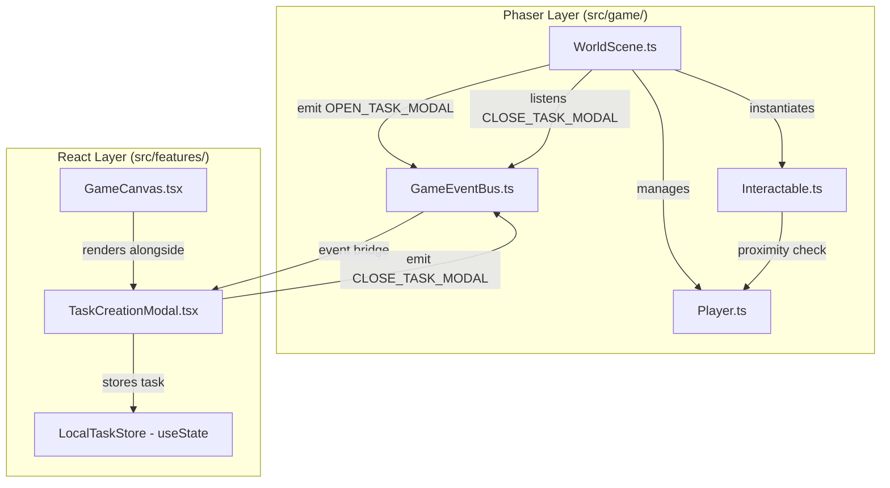
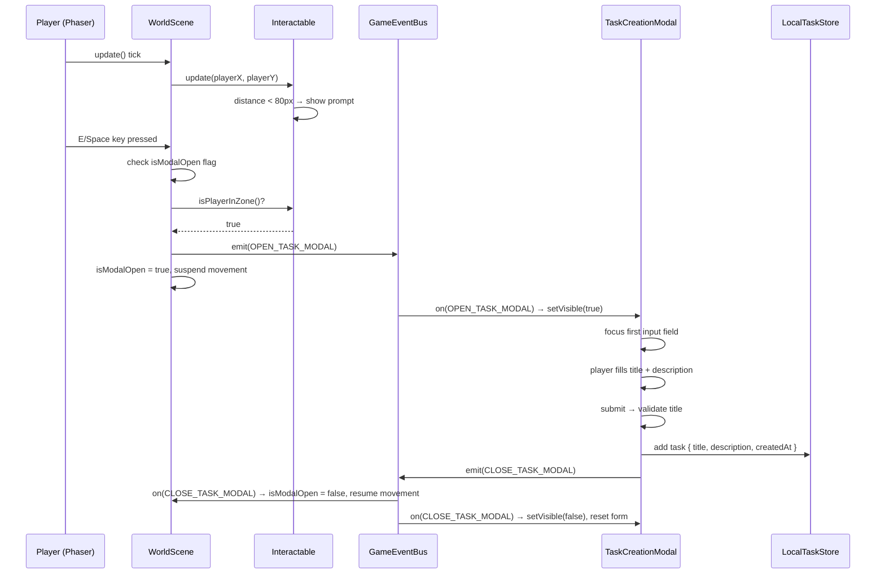
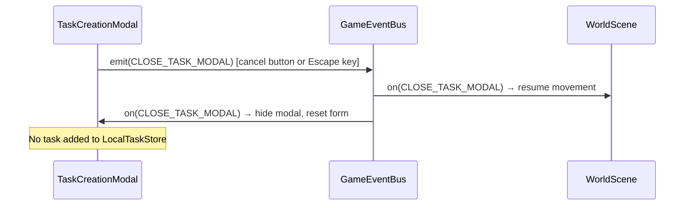

# Design Document: task-creation-interactable

## Overview

This feature adds a fixed interactive object (Quest Board) to the QuestBoard game world. When the player walks within 80px and presses E or Space, a React modal overlay opens over the Phaser canvas, allowing the player to create a new task stored in local React state. All cross-layer communication is exclusively via `GameEventBus`, preserving the strict Phaser ↔ React isolation boundary.

---

## Architecture



---

## Sequence Diagrams

### Happy Path: Player Opens and Submits Task



### Cancel / Escape Path



---

## Components and Interfaces

### Component 1: `Interactable` (`src/game/entities/Interactable.ts`)

**Purpose**: A pure Phaser entity that renders a visible object on the map, tracks player proximity, shows/hides an interaction prompt, and exposes a method to check if the player is in range.

**Interface**:
```typescript
class Interactable extends Phaser.GameObjects.Container {
  constructor(scene: Phaser.Scene, x: number, y: number)

  /** Called every update tick with the player's current world position. */
  update(playerX: number, playerY: number): void

  /** Returns true if the player is strictly less than 80px away. */
  isPlayerInZone(): boolean

  /** Cleans up event listeners and destroys the container. */
  destroy(fromScene?: boolean): void
}
```

**Responsibilities**:
- Render a colored rectangle (e.g., 32×32, gold `#FFD700`) as a placeholder sprite
- Render an `InteractionPrompt` text object (`"[E] New Task"`) above the rectangle, initially hidden
- On each `update()` call, compute Euclidean distance to the player and show/hide the prompt
- Cache the last computed distance so `isPlayerInZone()` is a pure getter (no re-computation)

---

### Component 2: `WorldScene` updates (`src/game/scenes/WorldScene.ts`)

**Purpose**: Manages the `Interactable` instance, registers interaction keys, handles proximity-gated key events, and suspends/resumes player movement via the `GameEventBus`.

**New private fields**:
```typescript
private interactable!: Interactable
private interactKey!: Phaser.Input.Keyboard.Key
private spaceKey!: Phaser.Input.Keyboard.Key
private isModalOpen: boolean = false
```

**Responsibilities**:
- Instantiate `Interactable` at a fixed position (e.g., `WORLD_WIDTH / 2 + 200, WORLD_HEIGHT / 2`) during `create()`
- Register `E` and `Space` keys during `create()`
- Listen for `GAME_EVENTS.CLOSE_TASK_MODAL` on `GameEventBus` during `create()`
- In `update()`: call `interactable.update(player.x, player.y)`, then check key presses
- On key press: if `!isModalOpen && interactable.isPlayerInZone()` → emit `OPEN_TASK_MODAL`, set `isModalOpen = true`, call `player.setVelocity(0, 0)` and stop processing movement
- On `CLOSE_TASK_MODAL`: set `isModalOpen = false`, call `player.setVelocity(0, 0)` to clear residual velocity

---

### Component 3: `TaskCreationModal` (`src/features/tasks/components/TaskCreationModal.tsx`)

**Purpose**: A pure React overlay component that listens for `OPEN_TASK_MODAL`, renders a task creation form, validates input, stores the task in `LocalTaskStore`, and emits `CLOSE_TASK_MODAL` on submit or cancel.

**Interface**:
```typescript
interface Task {
  id: string           // crypto.randomUUID()
  title: string        // trimmed, non-empty
  description: string  // trimmed, may be empty
  createdAt: string    // ISO 8601 timestamp
}

interface TaskCreationModalProps {
  onTaskCreated: (task: Task) => void
}

function TaskCreationModal(props: TaskCreationModalProps): JSX.Element | null
```

**Responsibilities**:
- Subscribe to `GAME_EVENTS.OPEN_TASK_MODAL` in a `useEffect` → set `isOpen = true`
- Subscribe to `GAME_EVENTS.CLOSE_TASK_MODAL` in the same `useEffect` → set `isOpen = false`, reset form
- Unsubscribe both listeners on unmount
- When `isOpen` is false, render `null`
- When `isOpen` is true, render a full-screen overlay with a centered dialog
- Manage controlled inputs: `title` (string), `description` (string), `titleError` (string | null)
- On submit: trim title, validate non-empty, create `Task` object, call `props.onTaskCreated(task)`, log to console, emit `CLOSE_TASK_MODAL`
- On cancel or Escape: emit `CLOSE_TASK_MODAL` (the `CLOSE_TASK_MODAL` listener then hides the modal)
- Move focus to the title input when modal opens (`useEffect` on `isOpen`)
- Include `role="dialog"`, `aria-modal="true"`, `aria-labelledby` pointing to the dialog title

---

### Component 4: `GameCanvas` updates (`src/features/game/components/GameCanvas.tsx`)

**Purpose**: Render `<TaskCreationModal>` as a sibling to the game container div, passing the `onTaskCreated` callback that updates `LocalTaskStore`.

**Updated structure**:
```typescript
function GameCanvas(): JSX.Element {
  const containerRef = useRef<HTMLDivElement>(null)
  const [tasks, setTasks] = useState<Task[]>([])

  const handleTaskCreated = useCallback((task: Task) => {
    setTasks(prev => [...prev, task])
    console.log('[LocalTaskStore] Task added:', task)
  }, [])

  // ... existing useEffect for startGame/destroyGame ...

  return (
    <div style={{ position: 'relative', width: '100%', height: '100vh' }}>
      <div ref={containerRef} id="game-container" style={{ width: '100%', height: '100%' }} />
      <TaskCreationModal onTaskCreated={handleTaskCreated} />
    </div>
  )
}
```

**Note**: `LocalTaskStore` lives as `useState<Task[]>` in `GameCanvas`. This keeps tasks scoped to the game session without requiring a global store. If `App.tsx` needs access to tasks in the future, the state can be lifted there.

---

### Component 5: `GameEventBus` updates (`src/game/GameEventBus.ts`)

**Purpose**: Add two new event keys to `GAME_EVENTS`.

```typescript
export const GAME_EVENTS = {
  // ... existing keys ...
  OPEN_TASK_MODAL:  'ui:open_task_modal',
  CLOSE_TASK_MODAL: 'ui:close_task_modal',
} as const
```

---

## Data Models

### `Task`

```typescript
interface Task {
  id: string        // crypto.randomUUID() — unique per task
  title: string     // trimmed, at least 1 non-whitespace character
  description: string // trimmed, may be empty string
  createdAt: string // new Date().toISOString()
}
```

**Validation Rules**:
- `title.trim().length > 0` — required, must contain at least one non-whitespace character
- `title` is trimmed before storage
- `description` is trimmed before storage; empty string is valid
- `id` is generated at submission time, never user-supplied
- `createdAt` is generated at submission time, never user-supplied

---

## Algorithmic Pseudocode

### Interaction Key Handling (WorldScene.update)

```pascal
ALGORITHM handleInteractionKeys()
INPUT: none (reads scene state)
OUTPUT: none (side effects: emits event, suspends movement)

BEGIN
  IF isModalOpen THEN
    RETURN  // guard: no re-emit while modal is open
  END IF

  keyPressed ← interactKey.justDown OR spaceKey.justDown

  IF keyPressed THEN
    IF interactable.isPlayerInZone() THEN
      isModalOpen ← true
      player.setVelocity(0, 0)
      GameEventBus.emit(GAME_EVENTS.OPEN_TASK_MODAL)
    END IF
  END IF
END
```

**Preconditions:**
- `interactable` is initialized
- `interactKey` and `spaceKey` are registered Phaser keys
- `player` is initialized with arcade physics

**Postconditions:**
- If emitted: `isModalOpen = true`, player velocity is zero
- If not emitted: no state change

### Task Form Submission

```pascal
ALGORITHM handleSubmit(event)
INPUT: form submit event
OUTPUT: none (side effects: stores task, emits event)

BEGIN
  event.preventDefault()

  trimmedTitle ← title.trim()

  IF trimmedTitle = '' THEN
    titleError ← 'Title is required'
    RETURN
  END IF

  task ← {
    id:          crypto.randomUUID(),
    title:       trimmedTitle,
    description: description.trim(),
    createdAt:   new Date().toISOString()
  }

  props.onTaskCreated(task)
  GameEventBus.emit(GAME_EVENTS.CLOSE_TASK_MODAL)
  // CLOSE_TASK_MODAL listener resets form and hides modal
END
```

**Preconditions:**
- `title` is a controlled string state value
- `description` is a controlled string state value
- `props.onTaskCreated` is a valid callback

**Postconditions:**
- If valid: task stored, form reset, modal hidden, player movement resumed
- If invalid: `titleError` set, no task stored, modal remains open

### Modal Visibility via GameEventBus

```pascal
ALGORITHM setupEventListeners() [useEffect]
INPUT: none
OUTPUT: cleanup function

BEGIN
  PROCEDURE openHandler()
    setIsOpen(true)
  END PROCEDURE

  PROCEDURE closeHandler()
    setIsOpen(false)
    setTitle('')
    setDescription('')
    setTitleError(null)
  END PROCEDURE

  GameEventBus.on(GAME_EVENTS.OPEN_TASK_MODAL, openHandler)
  GameEventBus.on(GAME_EVENTS.CLOSE_TASK_MODAL, closeHandler)

  RETURN PROCEDURE cleanup()
    GameEventBus.off(GAME_EVENTS.OPEN_TASK_MODAL, openHandler)
    GameEventBus.off(GAME_EVENTS.CLOSE_TASK_MODAL, closeHandler)
  END PROCEDURE
END
```

**Preconditions:**
- `GameEventBus` is the singleton emitter
- Component is mounted

**Postconditions:**
- On unmount: both listeners are removed (no memory leaks)

---

## Key Functions with Formal Specifications

### `Interactable.update(playerX, playerY)`

**Preconditions:**
- `playerX` and `playerY` are finite numbers (world coordinates)
- The `Interactable` is initialized with valid `x`, `y` world coordinates

**Postconditions:**
- If `distance < 80`: `promptText.setVisible(true)`, `_inZone = true`
- If `distance >= 80`: `promptText.setVisible(false)`, `_inZone = false`
- `distance = sqrt((playerX - this.x)² + (playerY - this.y)²)`

**Loop Invariants:** N/A (no loops)

### `Interactable.isPlayerInZone()`

**Preconditions:**
- `update()` has been called at least once this frame

**Postconditions:**
- Returns `this._inZone` — the cached result from the last `update()` call
- Pure getter, no side effects

### `TaskCreationModal` — Escape key handler

**Preconditions:**
- Modal is open (`isOpen = true`)
- Component is mounted

**Postconditions:**
- `GameEventBus.emit(GAME_EVENTS.CLOSE_TASK_MODAL)` is called exactly once
- The `CLOSE_TASK_MODAL` listener then hides the modal (not the key handler directly)

---

## Error Handling

### Error Scenario 1: Empty Title Submission

**Condition**: User clicks Submit with an empty or whitespace-only title  
**Response**: `titleError` state is set to `"Title is required"`, rendered as an inline error message adjacent to the title input with `role="alert"`  
**Recovery**: User types a valid title; error clears on next successful submission attempt

### Error Scenario 2: Modal Opened While Already Open

**Condition**: `OPEN_TASK_MODAL` emitted while `isModalOpen = true` in `WorldScene`  
**Response**: `WorldScene` guards against re-emission with the `isModalOpen` flag — the event is never emitted a second time  
**Recovery**: N/A — prevented at source

### Error Scenario 3: Component Unmounts While Modal Is Open

**Condition**: `TaskCreationModal` unmounts while `isOpen = true` (e.g., route change)  
**Response**: `useEffect` cleanup removes both `GameEventBus` listeners  
**Recovery**: No memory leak; `WorldScene` will still receive `CLOSE_TASK_MODAL` if emitted later (no-op since modal is gone)

---

## Testing Strategy

### Unit Testing Approach

- Test `Interactable.isPlayerInZone()` with distances exactly at, above, and below 80px
- Test `TaskCreationModal` form validation: empty string, whitespace-only string, valid string
- Test that `onTaskCreated` is called with correctly trimmed title and description
- Test that `CLOSE_TASK_MODAL` is emitted on submit and on cancel
- Test that the modal resets form fields after `CLOSE_TASK_MODAL`

### Property-Based Testing Approach

**Property Test Library**: `fast-check` (already installed as devDependency)

See **Correctness Properties** section below for the full list of properties.

### Integration Testing Approach

- Render `<GameCanvas>` (with mocked `startGame`/`destroyGame`) and verify that emitting `OPEN_TASK_MODAL` on `GameEventBus` makes the modal visible
- Verify that submitting the form emits `CLOSE_TASK_MODAL` and calls `onTaskCreated`
- Verify that the `tasks` array in `GameCanvas` grows by one after a valid submission

---

## Performance Considerations

- `Interactable.update()` runs every Phaser frame (~60fps). The proximity check is a single Euclidean distance computation — O(1), negligible cost.
- `TaskCreationModal` renders `null` when closed, so there is no DOM overhead while the modal is hidden.
- `GameEventBus` listeners are added once on mount and removed on unmount — no per-frame React re-renders from the event bus.

---

## Security Considerations

- No backend calls in this iteration — no XSS or injection surface from network responses.
- Task title and description are rendered as React text content (not `dangerouslySetInnerHTML`), so user input cannot inject HTML.
- `crypto.randomUUID()` is used for task IDs — no sequential or predictable IDs.

---

## Dependencies

- **Phaser 3** (`^3.60.0`) — already installed; used for `Interactable`, `WorldScene` updates
- **React 19** (`^19.2.6`) — already installed; used for `TaskCreationModal`, `GameCanvas` updates
- **fast-check** (`^3.0.0`) — already installed as devDependency; used for property-based tests
- **No new dependencies required**

---

## Correctness Properties

*A property is a characteristic or behavior that should hold true across all valid executions of a system — essentially, a formal statement about what the system should do. Properties serve as the bridge between human-readable specifications and machine-verifiable correctness guarantees.*

### Property 1: Proximity threshold is exclusive at exactly 80px

*For any* player position, the `Interactable` interaction zone considers the player inside if and only if the Euclidean distance is **strictly less than** 80 pixels. At exactly 80px the player is outside; at 79.9px the player is inside.

**Validates: Requirements 1.4, 1.5, 1.6**

---

### Property 2: Whitespace-only titles are rejected

*For any* string composed entirely of whitespace characters (spaces, tabs, newlines), submitting it as the task title SHALL be rejected — no task is added to `LocalTaskStore` and a validation error is displayed.

**Validates: Requirements 5.1, 5.2, 5.3**

---

### Property 3: Valid title submission round-trip preserves trimmed content

*For any* string that contains at least one non-whitespace character, submitting it as the task title SHALL result in a task stored in `LocalTaskStore` whose `title` equals the original string with leading and trailing whitespace removed.

**Validates: Requirements 5.4, 5.5, 6.1**

---

### Property 4: Task addition grows the LocalTaskStore by exactly one

*For any* valid task submission, the length of the `LocalTaskStore` array SHALL increase by exactly one, and the new entry SHALL be the last element.

**Validates: Requirements 6.1, 6.4**

---

### Property 5: CLOSE_TASK_MODAL is always emitted exactly once per interaction

*For any* modal interaction (submit or cancel), `GAME_EVENTS.CLOSE_TASK_MODAL` SHALL be emitted exactly once on the `GameEventBus` — never zero times, never more than once.

**Validates: Requirements 6.2, 7.1, 7.2**

---

### Property 6: Form fields are empty after modal closes

*For any* sequence of open → (fill fields) → close (via submit or cancel), the title and description fields SHALL be empty strings after the modal closes, regardless of what was typed.

**Validates: Requirements 6.3, 7.4**

---

### Property 7: GameEventBus listeners are cleaned up on unmount

*For any* mount/unmount cycle of `TaskCreationModal`, the number of `OPEN_TASK_MODAL` and `CLOSE_TASK_MODAL` listeners on `GameEventBus` SHALL return to its pre-mount count after unmount.

**Validates: Requirements 8.4, 8.5**
