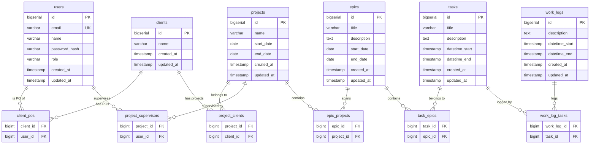

# Design Document — Task Management App (Java 21 / Spring Boot 3)

## Overview

The task management application is a full-stack web system built around a hierarchical domain model: **Client → Project → Epic → Task → WorkLog**. It exposes a RESTful JSON API (Spring Boot 3) consumed by a React 18 SPA. The backend follows clean architecture principles with three explicit layers: Controller → Service → Repository.

Key design goals:
- Stateless JWT authentication on every protected route (Spring Security filter chain + jjwt)
- Many-to-many JPA relationships between all hierarchy levels via explicit join tables
- Role-based access control enforced at the service layer
- Consistent error shapes and HTTP status codes across all endpoints
- ISO 8601 for every date/time field (stored as `LocalDate` / `LocalDateTime`, serialized via Jackson)
- Flyway-managed schema migrations
- Full Docker Compose setup for local development

---

## Architecture

```
┌──────────────────────────────────────────────────────┐
│                  Presentation Layer                   │
│   React 18 SPA (TypeScript, TanStack Query, Router)   │
└───────────────────────┬──────────────────────────────┘
                        │ HTTP / JSON (port 80 → proxy → 8080)
┌───────────────────────▼──────────────────────────────┐
│              Spring Boot 3 — API Layer                │
│   @RestController  →  @Service  →  @Repository        │
│   Spring Security filter chain (JWT)                  │
│   Bean Validation (@Valid, BindingResult)             │
│   @ControllerAdvice global exception handler          │
└───────────────────────┬──────────────────────────────┘
                        │ Spring Data JPA / Hibernate
┌───────────────────────▼──────────────────────────────┐
│                  PostgreSQL 15                        │
│   Schema managed by Flyway migrations                 │
└──────────────────────────────────────────────────────┘
```

### Request lifecycle

```
HTTP Request
  → JwtAuthenticationFilter (OncePerRequestFilter)
      extracts Bearer token, validates with jjwt,
      sets SecurityContextHolder
  → Spring Security authorization rules
      (permitAll for /api/auth/**, authenticated for rest)
  → @RestController
      @Valid on @RequestBody → MethodArgumentNotValidException
  → @Service
      business rules, role checks, referential integrity
  → JpaRepository
      Hibernate → PostgreSQL
  → @RestController maps result to ResponseEntity
  → @ControllerAdvice catches exceptions → error JSON
```

---

## Components and Interfaces

### Backend Components

| Component | Responsibility |
|---|---|
| `JwtAuthenticationFilter` | Extracts JWT from `Authorization` header, validates with jjwt, populates `SecurityContext` |
| `SecurityConfig` | Defines filter chain: public routes, stateless session, CORS |
| `JwtService` | Signs tokens (HS256, 24 h expiry) and parses/validates claims using jjwt |
| `*Controller` | Maps HTTP ↔ DTO, delegates to service, returns `ResponseEntity` |
| `*Service` | Business logic, role enforcement, referential integrity checks |
| `*Repository` | Spring Data JPA interface extending `JpaRepository` |
| `GlobalExceptionHandler` | `@ControllerAdvice` mapping exceptions to consistent error JSON |
| `PasswordEncoder` | BCrypt bean (Spring Security) |

### Frontend Components

| Component | Responsibility |
|---|---|
| `AuthProvider` | Stores JWT in `localStorage`, exposes auth context |
| `apiClient` | Axios instance with JWT `Authorization` interceptor |
| `use*` hooks | TanStack Query hooks per resource |
| `ProtectedRoute` | Redirects unauthenticated users to `/login` |
| Page components | One page per resource |

### Service Interfaces (Java)

```java
public interface AuthService {
    UserResponse register(RegisterRequest request);
    LoginResponse login(LoginRequest request);
}

public interface ClientService {
    ClientResponse create(CreateClientRequest request);
    ClientResponse update(Long id, UpdateClientRequest request);
    void delete(Long id);
    ClientResponse findById(Long id);
    List<ClientResponse> findAll();
}

public interface ProjectService {
    ProjectResponse create(CreateProjectRequest request);
    ProjectResponse update(Long id, UpdateProjectRequest request);
    void delete(Long id);
    ProjectResponse findById(Long id);
    List<ProjectResponse> findAll();
}

public interface EpicService {
    EpicResponse create(CreateEpicRequest request);
    EpicResponse update(Long id, UpdateEpicRequest request);
    void delete(Long id);
    EpicResponse findById(Long id);
    List<EpicResponse> findByProjectId(Long projectId);
}

public interface TaskService {
    TaskResponse create(CreateTaskRequest request);
    TaskResponse update(Long id, UpdateTaskRequest request);
    void delete(Long id);
    TaskResponse findById(Long id);
    List<TaskResponse> findByEpicId(Long epicId);
}

public interface WorkLogService {
    WorkLogResponse create(CreateWorkLogRequest request);
    WorkLogResponse update(Long id, UpdateWorkLogRequest request);
    void delete(Long id);
    WorkLogResponse findById(Long id);
    List<WorkLogResponse> findByTaskId(Long taskId);
}
```

---

## Data Models

### Entity Relationship Diagram



### JPA Entities

```java
// Role enum
public enum Role { REGULAR_USER, SUPERVISOR, PO }

@Entity @Table(name = "users")
public class User {
    @Id @GeneratedValue(strategy = GenerationType.IDENTITY)
    private Long id;
    @Column(unique = true, nullable = false) private String email;
    @Column(nullable = false) private String name;
    @Column(nullable = false) private String passwordHash;
    @Enumerated(EnumType.STRING) @Column(nullable = false)
    private Role role = Role.REGULAR_USER;
    private LocalDateTime createdAt;
    private LocalDateTime updatedAt;
}

@Entity @Table(name = "clients")
public class Client {
    @Id @GeneratedValue(strategy = GenerationType.IDENTITY)
    private Long id;
    @Column(nullable = false) private String name;

    @ManyToMany
    @JoinTable(name = "client_pos",
        joinColumns = @JoinColumn(name = "client_id"),
        inverseJoinColumns = @JoinColumn(name = "user_id"))
    private Set<User> pos = new HashSet<>();

    private LocalDateTime createdAt;
    private LocalDateTime updatedAt;
}

@Entity @Table(name = "projects")
public class Project {
    @Id @GeneratedValue(strategy = GenerationType.IDENTITY)
    private Long id;
    @Column(nullable = false) private String name;
    private LocalDate startDate;
    private LocalDate endDate;

    @ManyToMany
    @JoinTable(name = "project_clients",
        joinColumns = @JoinColumn(name = "project_id"),
        inverseJoinColumns = @JoinColumn(name = "client_id"))
    private Set<Client> clients = new HashSet<>();

    @ManyToMany
    @JoinTable(name = "project_supervisors",
        joinColumns = @JoinColumn(name = "project_id"),
        inverseJoinColumns = @JoinColumn(name = "user_id"))
    private Set<User> supervisors = new HashSet<>();

    private LocalDateTime createdAt;
    private LocalDateTime updatedAt;
}

@Entity @Table(name = "epics")
public class Epic {
    @Id @GeneratedValue(strategy = GenerationType.IDENTITY)
    private Long id;
    @Column(nullable = false) private String title;
    private String description;
    private LocalDate startDate;
    private LocalDate endDate;

    @ManyToMany
    @JoinTable(name = "epic_projects",
        joinColumns = @JoinColumn(name = "epic_id"),
        inverseJoinColumns = @JoinColumn(name = "project_id"))
    private Set<Project> projects = new HashSet<>();

    private LocalDateTime createdAt;
    private LocalDateTime updatedAt;
}

@Entity @Table(name = "tasks")
public class Task {
    @Id @GeneratedValue(strategy = GenerationType.IDENTITY)
    private Long id;
    @Column(nullable = false) private String title;
    private String description;
    private LocalDateTime datetimeStart;
    private LocalDateTime datetimeEnd;

    @ManyToMany
    @JoinTable(name = "task_epics",
        joinColumns = @JoinColumn(name = "task_id"),
        inverseJoinColumns = @JoinColumn(name = "epic_id"))
    private Set<Epic> epics = new HashSet<>();

    private LocalDateTime createdAt;
    private LocalDateTime updatedAt;
}

@Entity @Table(name = "work_logs")
public class WorkLog {
    @Id @GeneratedValue(strategy = GenerationType.IDENTITY)
    private Long id;
    private String description;
    private LocalDateTime datetimeStart;
    private LocalDateTime datetimeEnd;

    @ManyToMany
    @JoinTable(name = "work_log_tasks",
        joinColumns = @JoinColumn(name = "work_log_id"),
        inverseJoinColumns = @JoinColumn(name = "task_id"))
    private Set<Task> tasks = new HashSet<>();

    private LocalDateTime createdAt;
    private LocalDateTime updatedAt;
}
```

### Flyway Migration (V1)

The initial migration (`V1__init.sql`) creates all tables and join tables with appropriate primary keys, foreign keys, and unique constraints. Subsequent migrations handle schema changes.

---

## REST API Endpoints

All endpoints return `Content-Type: application/json`. Protected endpoints require `Authorization: Bearer <token>`.

### Authentication

| Method | Path | Auth | Description |
|---|---|---|---|
| POST | `/api/auth/register` | No | Register new user |
| POST | `/api/auth/login` | No | Login, receive JWT |

**POST /api/auth/register**
```json
// Request
{ "email": "user@example.com", "name": "Jane Doe", "password": "secret123" }

// 201 Response
{ "id": 1, "email": "user@example.com", "name": "Jane Doe", "role": "REGULAR_USER" }
```

**POST /api/auth/login**
```json
// Request
{ "email": "user@example.com", "password": "secret123" }

// 200 Response
{ "token": "eyJ...", "expiresIn": 86400 }
```

---

### Clients

| Method | Path | Auth | Role | Description |
|---|---|---|---|---|
| GET | `/api/clients` | Yes | supervisor | List all clients |
| POST | `/api/clients` | Yes | supervisor | Create client |
| GET | `/api/clients/{id}` | Yes | supervisor | Get client by ID |
| PUT | `/api/clients/{id}` | Yes | supervisor | Update client |
| DELETE | `/api/clients/{id}` | Yes | supervisor | Delete client |

**POST /api/clients**
```json
// Request
{ "name": "Acme Corp", "poUserIds": [1, 2] }

// 201 Response
{ "id": 1, "name": "Acme Corp", "pos": [{ "id": 1, "name": "Alice" }] }
```

---

### Projects

| Method | Path | Auth | Role | Description |
|---|---|---|---|---|
| GET | `/api/projects` | Yes | any | List all projects |
| POST | `/api/projects` | Yes | supervisor | Create project |
| GET | `/api/projects/{id}` | Yes | any | Get project with clients & supervisors |
| PUT | `/api/projects/{id}` | Yes | supervisor | Update project |
| DELETE | `/api/projects/{id}` | Yes | supervisor | Delete project |

**POST /api/projects**
```json
// Request
{
  "name": "Website Redesign",
  "startDate": "2024-01-01",
  "endDate": "2024-06-30",
  "clientIds": [1],
  "supervisorUserIds": [2]
}

// 201 Response
{ "id": 1, "name": "Website Redesign", "startDate": "2024-01-01", "endDate": "2024-06-30",
  "clients": [...], "supervisors": [...] }
```

---

### Epics

| Method | Path | Auth | Role | Description |
|---|---|---|---|---|
| GET | `/api/projects/{projectId}/epics` | Yes | any | List epics for a project |
| POST | `/api/epics` | Yes | supervisor | Create epic |
| GET | `/api/epics/{id}` | Yes | any | Get epic by ID |
| PUT | `/api/epics/{id}` | Yes | supervisor | Update epic |
| DELETE | `/api/epics/{id}` | Yes | supervisor | Delete epic |

**POST /api/epics**
```json
// Request
{
  "title": "User Authentication",
  "description": "All auth-related work",
  "startDate": "2024-01-01",
  "endDate": "2024-02-28",
  "projectIds": [1]
}

// 201 Response
{ "id": 1, "title": "User Authentication", "description": "...",
  "startDate": "2024-01-01", "endDate": "2024-02-28", "projects": [...] }
```

---

### Tasks

| Method | Path | Auth | Role | Description |
|---|---|---|---|---|
| GET | `/api/epics/{epicId}/tasks` | Yes | any | List tasks for an epic |
| POST | `/api/tasks` | Yes | any | Create task |
| GET | `/api/tasks/{id}` | Yes | any | Get task by ID |
| PUT | `/api/tasks/{id}` | Yes | any | Update task |
| DELETE | `/api/tasks/{id}` | Yes | any | Delete task |

**POST /api/tasks**
```json
// Request
{
  "title": "Implement login endpoint",
  "description": "POST /auth/login with JWT response",
  "datetimeStart": "2024-01-10T09:00:00Z",
  "datetimeEnd": "2024-01-12T18:00:00Z",
  "epicIds": [1]
}

// 201 Response
{ "id": 1, "title": "...", "datetimeStart": "2024-01-10T09:00:00Z",
  "datetimeEnd": "2024-01-12T18:00:00Z", "epics": [...] }
```

---

### WorkLogs

| Method | Path | Auth | Role | Description |
|---|---|---|---|---|
| GET | `/api/tasks/{taskId}/worklogs` | Yes | any | List worklogs for a task |
| POST | `/api/worklogs` | Yes | any | Create worklog |
| GET | `/api/worklogs/{id}` | Yes | any | Get worklog by ID |
| PUT | `/api/worklogs/{id}` | Yes | any | Update worklog |
| DELETE | `/api/worklogs/{id}` | Yes | any | Delete worklog |

**POST /api/worklogs**
```json
// Request
{
  "description": "Implemented JWT signing logic",
  "datetimeStart": "2024-01-10T09:00:00Z",
  "datetimeEnd": "2024-01-10T12:00:00Z",
  "taskIds": [1]
}

// 201 Response
{ "id": 1, "description": "...", "datetimeStart": "...", "datetimeEnd": "...", "tasks": [...] }
```

---

### Error Response Shape

```json
{
  "error": {
    "code": "VALIDATION_ERROR",
    "message": "Request validation failed",
    "fields": [
      { "field": "endDate", "message": "endDate must be after startDate" }
    ]
  }
}
```

HTTP status codes:
- `400` — malformed request body
- `401` — missing, invalid, or expired JWT
- `403` — authenticated but insufficient role
- `404` — resource not found
- `409` — conflict (duplicate email, referential integrity violation)
- `422` — semantically invalid data (date inversion, non-existent reference)

---

## JWT Authentication & Authorization Flow

### Spring Security Configuration

```java
@Configuration
@EnableWebSecurity
public class SecurityConfig {

    @Bean
    public SecurityFilterChain filterChain(HttpSecurity http,
                                           JwtAuthenticationFilter jwtFilter) throws Exception {
        return http
            .csrf(AbstractHttpConfigurer::disable)
            .sessionManagement(s -> s.sessionCreationPolicy(SessionCreationPolicy.STATELESS))
            .authorizeHttpRequests(auth -> auth
                .requestMatchers("/api/auth/**").permitAll()
                .anyRequest().authenticated()
            )
            .addFilterBefore(jwtFilter, UsernamePasswordAuthenticationFilter.class)
            .build();
    }

    @Bean
    public PasswordEncoder passwordEncoder() {
        return new BCryptPasswordEncoder();
    }
}
```

### JWT Filter

```java
@Component
public class JwtAuthenticationFilter extends OncePerRequestFilter {

    @Override
    protected void doFilterInternal(HttpServletRequest request,
                                    HttpServletResponse response,
                                    FilterChain chain) throws ServletException, IOException {
        String header = request.getHeader("Authorization");
        if (header != null && header.startsWith("Bearer ")) {
            String token = header.substring(7);
            try {
                Claims claims = jwtService.parseToken(token);
                // build UsernamePasswordAuthenticationToken and set in SecurityContext
                UsernamePasswordAuthenticationToken auth =
                    new UsernamePasswordAuthenticationToken(
                        claims.getSubject(),
                        null,
                        List.of(new SimpleGrantedAuthority("ROLE_" + claims.get("role")))
                    );
                SecurityContextHolder.getContext().setAuthentication(auth);
            } catch (JwtException e) {
                // invalid/expired token — SecurityContext stays empty → 401 from Spring Security
            }
        }
        chain.doFilter(request, response);
    }
}
```

### JWT Service (jjwt)

```java
@Service
public class JwtService {

    private static final long EXPIRY_MS = 86_400_000L; // 24 hours

    public String generateToken(User user) {
        return Jwts.builder()
            .subject(user.getId().toString())
            .claim("role", user.getRole().name())
            .issuedAt(new Date())
            .expiration(new Date(System.currentTimeMillis() + EXPIRY_MS))
            .signWith(getSigningKey())
            .compact();
    }

    public Claims parseToken(String token) {
        return Jwts.parser()
            .verifyWith(getSigningKey())
            .build()
            .parseSignedClaims(token)
            .getPayload();
    }

    private SecretKey getSigningKey() {
        return Keys.hmacShaKeyFor(Decoders.BASE64.decode(secretKey));
    }
}
```

### Registration Flow

```
POST /api/auth/register
  → AuthController.register(@Valid RegisterRequest)
  → AuthService.register()
      → UserRepository.findByEmail() → if present → throw ConflictException (409)
      → validate password length >= 8 → if not → throw ValidationException (422)
      → passwordEncoder.encode(password)
      → UserRepository.save(new User(email, name, hash, REGULAR_USER))
  → 201 UserResponse
```

### Login Flow

```
POST /api/auth/login
  → AuthController.login(@Valid LoginRequest)
  → AuthService.login()
      → UserRepository.findByEmail() → if absent → throw UnauthorizedException (401)
      → passwordEncoder.matches(raw, hash) → if false → throw UnauthorizedException (401)
      → jwtService.generateToken(user)
  → 200 { token, expiresIn: 86400 }
```

### Protected Request Flow

```
GET /api/projects (Authorization: Bearer <token>)
  → JwtAuthenticationFilter
      → jwtService.parseToken(token) → if JwtException → SecurityContext empty
  → Spring Security checks authentication → if absent → 401
  → ProjectController.findAll()
  → ProjectService.findAll()
  → ProjectRepository.findAll()
  → 200 [ProjectResponse...]
```

### Role Enforcement

Role checks are performed in the service layer:

```java
// In service methods that require SUPERVISOR role
private void requireSupervisor(Authentication auth) {
    boolean isSupervisor = auth.getAuthorities().stream()
        .anyMatch(a -> a.getAuthority().equals("ROLE_SUPERVISOR"));
    if (!isSupervisor) throw new ForbiddenException();
}
```

JWT payload structure:
```json
{
  "sub": "42",
  "role": "SUPERVISOR",
  "iat": 1700000000,
  "exp": 1700086400
}
```

---

## Project Folder Structure

```
task-management-app/
├── docker-compose.yml
├── README.md
│
├── backend/                              # Maven project (Java 21 + Spring Boot 3)
│   ├── pom.xml
│   ├── Dockerfile
│   └── src/
│       ├── main/
│       │   ├── java/com/example/taskmanager/
│       │   │   ├── TaskManagerApplication.java
│       │   │   │
│       │   │   ├── config/
│       │   │   │   ├── SecurityConfig.java
│       │   │   │   └── OpenApiConfig.java
│       │   │   │
│       │   │   ├── security/
│       │   │   │   ├── JwtService.java
│       │   │   │   ├── JwtAuthenticationFilter.java
│       │   │   │   └── UserDetailsServiceImpl.java
│       │   │   │
│       │   │   ├── domain/
│       │   │   │   ├── entity/
│       │   │   │   │   ├── User.java
│       │   │   │   │   ├── Client.java
│       │   │   │   │   ├── Project.java
│       │   │   │   │   ├── Epic.java
│       │   │   │   │   ├── Task.java
│       │   │   │   │   └── WorkLog.java
│       │   │   │   └── enums/
│       │   │   │       └── Role.java
│       │   │   │
│       │   │   ├── repository/
│       │   │   │   ├── UserRepository.java
│       │   │   │   ├── ClientRepository.java
│       │   │   │   ├── ProjectRepository.java
│       │   │   │   ├── EpicRepository.java
│       │   │   │   ├── TaskRepository.java
│       │   │   │   └── WorkLogRepository.java
│       │   │   │
│       │   │   ├── service/
│       │   │   │   ├── AuthService.java
│       │   │   │   ├── ClientService.java
│       │   │   │   ├── ProjectService.java
│       │   │   │   ├── EpicService.java
│       │   │   │   ├── TaskService.java
│       │   │   │   └── WorkLogService.java
│       │   │   │
│       │   │   ├── controller/
│       │   │   │   ├── AuthController.java
│       │   │   │   ├── ClientController.java
│       │   │   │   ├── ProjectController.java
│       │   │   │   ├── EpicController.java
│       │   │   │   ├── TaskController.java
│       │   │   │   └── WorkLogController.java
│       │   │   │
│       │   │   ├── dto/
│       │   │   │   ├── request/
│       │   │   │   │   ├── RegisterRequest.java
│       │   │   │   │   ├── LoginRequest.java
│       │   │   │   │   ├── CreateClientRequest.java
│       │   │   │   │   ├── UpdateClientRequest.java
│       │   │   │   │   ├── CreateProjectRequest.java
│       │   │   │   │   ├── UpdateProjectRequest.java
│       │   │   │   │   ├── CreateEpicRequest.java
│       │   │   │   │   ├── UpdateEpicRequest.java
│       │   │   │   │   ├── CreateTaskRequest.java
│       │   │   │   │   ├── UpdateTaskRequest.java
│       │   │   │   │   ├── CreateWorkLogRequest.java
│       │   │   │   │   └── UpdateWorkLogRequest.java
│       │   │   │   └── response/
│       │   │   │       ├── UserResponse.java
│       │   │   │       ├── LoginResponse.java
│       │   │   │       ├── ClientResponse.java
│       │   │   │       ├── ProjectResponse.java
│       │   │   │       ├── EpicResponse.java
│       │   │   │       ├── TaskResponse.java
│       │   │   │       ├── WorkLogResponse.java
│       │   │   │       └── ErrorResponse.java
│       │   │   │
│       │   │   └── exception/
│       │   │       ├── GlobalExceptionHandler.java
│       │   │       ├── ConflictException.java
│       │   │       ├── ForbiddenException.java
│       │   │       ├── NotFoundException.java
│       │   │       ├── UnauthorizedException.java
│       │   │       └── ValidationException.java
│       │   │
│       │   └── resources/
│       │       ├── application.yml
│       │       └── db/migration/
│       │           └── V1__init.sql
│       │
│       └── test/
│           └── java/com/example/taskmanager/
│               ├── service/          # unit tests (JUnit 5 + Mockito)
│               └── property/         # property-based tests (jqwik)
│
└── frontend/                         # Vite + React 18 (TypeScript)
    ├── package.json
    ├── vite.config.ts
    ├── tsconfig.json
    ├── Dockerfile
    ├── nginx.conf
    └── src/
        ├── main.tsx
        ├── App.tsx
        ├── api/
        │   └── client.ts             # Axios instance
        ├── context/
        │   └── AuthContext.tsx
        ├── hooks/
        │   ├── useAuth.ts
        │   ├── useClients.ts
        │   ├── useProjects.ts
        │   ├── useEpics.ts
        │   ├── useTasks.ts
        │   └── useWorkLogs.ts
        ├── pages/
        │   ├── LoginPage.tsx
        │   ├── RegisterPage.tsx
        │   ├── ClientsPage.tsx
        │   ├── ProjectsPage.tsx
        │   ├── EpicsPage.tsx
        │   ├── TasksPage.tsx
        │   └── WorkLogsPage.tsx
        └── components/
            └── ProtectedRoute.tsx
```

---

## Docker Compose Setup

```yaml
# docker-compose.yml
version: "3.9"

services:
  db:
    image: postgres:15-alpine
    environment:
      POSTGRES_DB: taskmanager
      POSTGRES_USER: taskmanager
      POSTGRES_PASSWORD: taskmanager
    ports:
      - "5432:5432"
    volumes:
      - postgres_data:/var/lib/postgresql/data
    healthcheck:
      test: ["CMD-SHELL", "pg_isready -U taskmanager"]
      interval: 5s
      timeout: 5s
      retries: 5

  backend:
    build: ./backend
    ports:
      - "8080:8080"
    environment:
      SPRING_DATASOURCE_URL: jdbc:postgresql://db:5432/taskmanager
      SPRING_DATASOURCE_USERNAME: taskmanager
      SPRING_DATASOURCE_PASSWORD: taskmanager
      JWT_SECRET: ${JWT_SECRET:-changeme-in-production-use-256bit-key}
      JWT_EXPIRY_MS: 86400000
    depends_on:
      db:
        condition: service_healthy

  frontend:
    build: ./frontend
    ports:
      - "80:80"
    depends_on:
      - backend

volumes:
  postgres_data:
```

**backend/Dockerfile**
```dockerfile
FROM maven:3.9-eclipse-temurin-21 AS build
WORKDIR /app
COPY pom.xml .
RUN mvn dependency:go-offline -q
COPY src ./src
RUN mvn package -DskipTests -q

FROM eclipse-temurin:21-jre-alpine
WORKDIR /app
COPY --from=build /app/target/*.jar app.jar
EXPOSE 8080
ENTRYPOINT ["java", "-jar", "app.jar"]
```

**frontend/Dockerfile**
```dockerfile
FROM node:20-alpine AS build
WORKDIR /app
COPY package*.json .
RUN npm ci
COPY . .
RUN npm run build

FROM nginx:alpine
COPY --from=build /app/dist /usr/share/nginx/html
COPY nginx.conf /etc/nginx/conf.d/default.conf
EXPOSE 80
```

**frontend/nginx.conf** (proxies `/api` to backend)
```nginx
server {
    listen 80;
    root /usr/share/nginx/html;
    index index.html;

    location /api/ {
        proxy_pass http://backend:8080;
        proxy_set_header Host $host;
        proxy_set_header X-Real-IP $remote_addr;
    }

    location / {
        try_files $uri $uri/ /index.html;
    }
}
```

---

## Correctness Properties

*A property is a characteristic or behavior that should hold true across all valid executions of a system — essentially, a formal statement about what the system should do. Properties serve as the bridge between human-readable specifications and machine-verifiable correctness guarantees.*

Property-based testing is appropriate here because the system contains pure business-logic functions (password validation, date range validation, JWT generation/parsing, entity creation round trips) where input variation meaningfully reveals edge cases and 100+ iterations add real value. We use **jqwik** as the PBT library for Java.

---

### Property 1: Valid registration always creates a REGULAR_USER

*For any* valid email address and password of 8 or more characters, calling the registration service SHALL succeed and the returned user SHALL have the role `REGULAR_USER`.

**Validates: Requirements 1.2, 3.2**

---

### Property 2: Short passwords are always rejected

*For any* password string of length 0 through 7 characters, the registration service SHALL throw a validation exception (resulting in HTTP 422).

**Validates: Requirements 1.4**

---

### Property 3: Passwords are never stored as plaintext

*For any* registered user, the stored `passwordHash` field SHALL NOT equal the plaintext password, and `BCryptPasswordEncoder.matches(plaintext, hash)` SHALL return `true`.

**Validates: Requirements 1.5**

---

### Property 4: Valid login returns a JWT with expiry ≤ 24 hours

*For any* registered user with correct credentials, the login service SHALL return a JWT whose `exp − iat` value is at most 86400 seconds.

**Validates: Requirements 2.1**

---

### Property 5: Invalid credentials always return 401

*For any* login attempt where either the email does not match a registered account or the password does not match the stored hash, the service SHALL throw an `UnauthorizedException`.

**Validates: Requirements 2.2, 2.3**

---

### Property 6: Missing or invalid JWT on protected endpoints always returns 401

*For any* protected endpoint, a request made without an `Authorization` header, with a malformed token, or with an expired token SHALL result in a 401 Unauthorized response.

**Validates: Requirements 2.4, 2.5**

---

### Property 7: Non-supervisor users are always denied supervisor-only operations

*For any* authenticated user whose role is `REGULAR_USER` or `PO`, any attempt to invoke a supervisor-only service method (create/update/delete Client, Project, or Epic) SHALL throw a `ForbiddenException`.

**Validates: Requirements 3.6**

---

### Property 8: Role assignment round trip

*For any* user assigned as a Supervisor of a Project or as a PO of a Client, retrieving that Project or Client SHALL include that user in the corresponding `supervisors` or `pos` collection.

**Validates: Requirements 3.3, 3.4**

---

### Property 9: Entity creation round trip

*For any* entity (Client, Project, Epic, Task, WorkLog) created with valid data, the `id` returned in the creation response SHALL be usable to retrieve an entity whose fields match the submitted data.

**Validates: Requirements 4.2, 5.2, 6.2, 7.2, 8.2**

---

### Property 10: Date/datetime inversion always returns 422

*For any* creation or update request for a Project, Epic, Task, or WorkLog where `endDate`/`datetimeEnd` precedes `startDate`/`datetimeStart`, the service SHALL throw a `ValidationException` (HTTP 422).

**Validates: Requirements 5.4, 6.4, 7.4, 8.4**

---

### Property 11: Non-existent reference always returns 422

*For any* creation or update request that includes one or more IDs (clientIds, supervisorUserIds, projectIds, epicIds, taskIds, poUserIds) where at least one ID does not correspond to an existing entity, the service SHALL throw a `ValidationException` (HTTP 422).

**Validates: Requirements 4.4, 5.5, 6.5, 7.5, 8.5**

---

### Property 12: Non-existent resource ID on GET always returns 404

*For any* GET request to a resource endpoint where the provided ID does not correspond to an existing entity, the service SHALL throw a `NotFoundException` (HTTP 404).

**Validates: Requirements 9.5**

---

### Property 13: All API responses carry Content-Type application/json

*For any* request to any API endpoint, the response SHALL include a `Content-Type: application/json` header regardless of the HTTP status code returned.

**Validates: Requirements 10.2**

---

### Property 14: Validation errors always include field-level details

*For any* request body that fails Bean Validation, the 422 error response body SHALL include an `error.fields` array where each entry identifies the invalid field name and the reason for rejection.

**Validates: Requirements 10.3**

---

### Property 15: Deleting a referenced entity returns 409

*For any* entity (Client, Project, Epic, Task) that is currently referenced by at least one child entity, a DELETE request for that entity SHALL return a 409 Conflict response and the entity SHALL remain in the database.

**Validates: Requirements 10.4**

---

### Property 16: Association list replacement is exact

*For any* update request that provides a list of valid IDs (poUserIds for Client, supervisorUserIds/clientIds for Project), retrieving the entity after the update SHALL return a collection containing exactly those referenced entities — no more, no fewer.

**Validates: Requirements 4.3, 5.6**

---

## Error Handling

### Exception Hierarchy

```java
// Base
public class AppException extends RuntimeException {
    private final int status;
    private final String code;
    public AppException(int status, String code, String message) { ... }
}

public class NotFoundException      extends AppException { /* 404 NOT_FOUND */ }
public class ConflictException      extends AppException { /* 409 CONFLICT */ }
public class ForbiddenException     extends AppException { /* 403 FORBIDDEN */ }
public class UnauthorizedException  extends AppException { /* 401 UNAUTHORIZED */ }
public class ValidationException    extends AppException {
    private final List<FieldError> fields;
    /* 422 VALIDATION_ERROR */
}
```

### Global Exception Handler

```java
@RestControllerAdvice
public class GlobalExceptionHandler {

    @ExceptionHandler(AppException.class)
    public ResponseEntity<ErrorResponse> handleApp(AppException ex) {
        return ResponseEntity.status(ex.getStatus())
            .body(new ErrorResponse(ex.getCode(), ex.getMessage(), null));
    }

    @ExceptionHandler(MethodArgumentNotValidException.class)
    public ResponseEntity<ErrorResponse> handleValidation(MethodArgumentNotValidException ex) {
        List<FieldError> fields = ex.getBindingResult().getFieldErrors().stream()
            .map(e -> new FieldError(e.getField(), e.getDefaultMessage()))
            .toList();
        return ResponseEntity.status(422)
            .body(new ErrorResponse("VALIDATION_ERROR", "Request validation failed", fields));
    }

    @ExceptionHandler(DataIntegrityViolationException.class)
    public ResponseEntity<ErrorResponse> handleIntegrity(DataIntegrityViolationException ex) {
        return ResponseEntity.status(409)
            .body(new ErrorResponse("CONFLICT", "Cannot delete: entity is referenced by child records", null));
    }
}
```

### Error Response DTO

```java
public record ErrorResponse(
    String code,
    String message,
    List<FieldError> fields
) {
    public record FieldError(String field, String message) {}
}
```

### Error Mapping Summary

| Scenario | HTTP Status | Code |
|---|---|---|
| Resource not found | 404 | `NOT_FOUND` |
| Duplicate email on register | 409 | `CONFLICT` |
| Delete referenced entity | 409 | `CONFLICT` |
| Missing/invalid/expired JWT | 401 | `UNAUTHORIZED` |
| Wrong credentials | 401 | `UNAUTHORIZED` |
| Insufficient role | 403 | `FORBIDDEN` |
| Bean Validation failure | 422 | `VALIDATION_ERROR` |
| Non-existent reference in body | 422 | `VALIDATION_ERROR` |
| Date inversion | 422 | `VALIDATION_ERROR` |

---

## Testing Strategy

### Dual Testing Approach

Both unit/property tests and integration tests are used for comprehensive coverage.

**Unit + Property Tests** (jqwik + JUnit 5 + Mockito):
- Service layer logic tested in isolation with mocked repositories
- Property-based tests use jqwik `@Property` and `@ForAll` annotations
- Minimum 100 iterations per property test (jqwik default)
- Each property test references its design document property via a comment tag:
  `// Feature: task-management-app, Property N: <property text>`

**Integration Tests** (Spring Boot Test + Testcontainers):
- Full HTTP stack tested against a real PostgreSQL container
- Cover end-to-end flows: register → login → CRUD operations
- Verify HTTP status codes, response shapes, and Content-Type headers

### Property Test Examples (jqwik)

```java
// Feature: task-management-app, Property 2: Short passwords are always rejected
@Property
void shortPasswordsAreRejected(@ForAll @IntRange(min = 0, max = 7) int length,
                                @ForAll @AlphaChars String base) {
    String password = base.substring(0, Math.min(length, base.length()));
    assertThatThrownBy(() -> authService.register(
        new RegisterRequest("test@example.com", "Name", password)))
        .isInstanceOf(ValidationException.class);
}

// Feature: task-management-app, Property 10: Date inversion returns 422
@Property
void dateInversionIsRejected(@ForAll LocalDate start, @ForAll LocalDate end) {
    Assume.that(end.isBefore(start));
    assertThatThrownBy(() -> projectService.create(
        new CreateProjectRequest("P", start, end, List.of(), List.of())))
        .isInstanceOf(ValidationException.class);
}

// Feature: task-management-app, Property 9: Entity creation round trip
@Property
void clientCreationRoundTrip(@ForAll @NotBlank String name) {
    ClientResponse created = clientService.create(new CreateClientRequest(name, List.of()));
    ClientResponse fetched = clientService.findById(created.id());
    assertThat(fetched.name()).isEqualTo(name);
}
```

### Unit Test Focus Areas

- `JwtService`: token generation, parsing, expiry validation
- `AuthService`: registration validation, password hashing, login logic
- Each `*Service`: role checks, referential integrity, date validation
- `GlobalExceptionHandler`: correct HTTP status and error shape per exception type

### Integration Test Focus Areas

- Full auth flow: register → login → use token on protected endpoint
- CRUD lifecycle for each entity
- Hierarchical retrieval endpoints
- Error scenarios: 401, 403, 404, 409, 422
